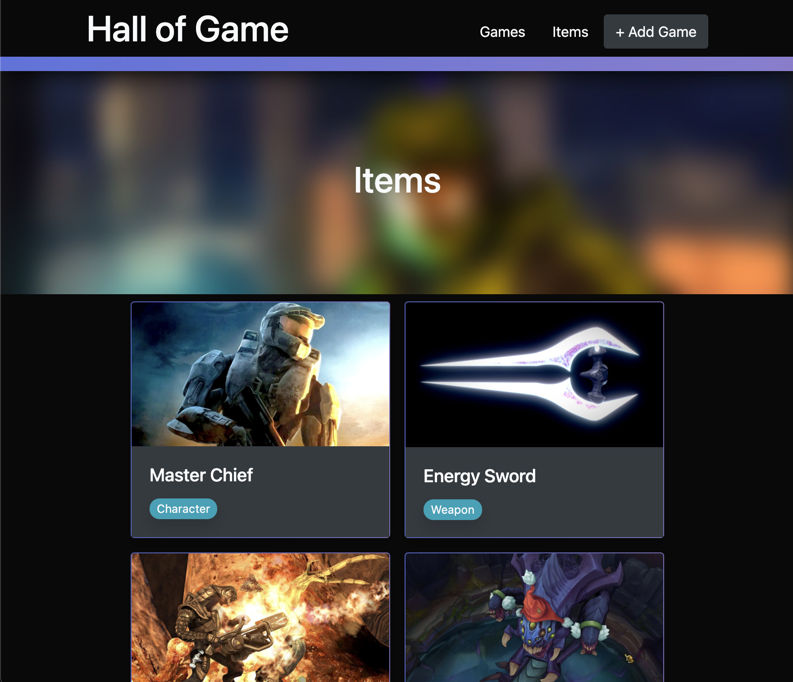

## Hall of Game

<a href="http://hallofgame.herokuapp.com/items">Click here to launch HoG!</a>

Hall of Game is currently a database for games and their entities, but hopes to evolve into a place where you can interact with and explore a community of people who like the games you like. Through collections, leaderboards, ratings, comments and more, HoG aims to be a place where you can explore everything and anything about a game you love.

## Technologies Used

<ul>
    <li>HTML</li>
    <li>CSS</li>
    <li>Bootstrap</li>
    <li>Express.js</li>
    <li>Mongoose</li>
    <li>MongoDB Atlas</li>
    <li>EJS</li>
    <li>Heroku</li>
</ul>

## Future Updates

- [ ] Upvote/downvote logic on entities
- [ ] Complete User System with comments, custom collections, and user-specific CRUD
- [ ] Sorting, filtering, and search functionality
- [ ] JS driven Animations
- [ ] image API integration for consistent, scaled images
- [ ] (limited) 3d model viewer, map viewer + VR/AR potential
